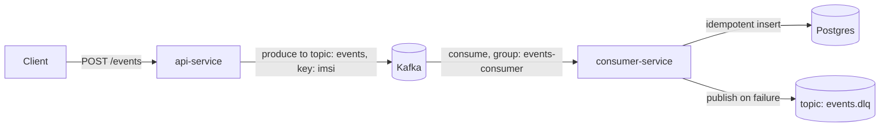

# event-ingestion-platform

A clean-room demo of a production-style ingestion pattern:

- **API Service** exposes `POST /events` and publishes to **Kafka**
- **Consumer Service** processes events and writes to **Postgres**
- Processing is **at-least-once** (manual offset commit after DB write)
- Correctness is ensured with an **idempotent consumer** (unique `event_id` + `ON CONFLICT DO NOTHING`)
- Failures go through **retry with backoff**, then **DLQ** (`events.dlq`)
- Local environment via **Docker Compose** (Kafka + Postgres + services)

## Architecture


## Run locally

### Prerequisites
- Docker + Docker Compose

### Start everything
```bash
docker compose up --build
```

### Send a sample event
```bash
curl -X POST http://localhost:8080/events \
  -H "Content-Type: application/json" \
  -d '{"eventId":"e1","imsi":"123456789012345","payload":{"type":"ULR","status":"ACK"},"ts":"2026-03-14T12:00:00Z"}'
```

### Verify data landed in Postgres
```bash
psql -h localhost -U app -d eventsdb -c "select event_id, imsi, created_at from events order by created_at desc limit 10;"
```

Default credentials (from docker-compose):
- user: `app`
- password: `app`
- database: `eventsdb`

## Design notes

### At-least-once + duplicates
We commit Kafka offsets **after** the DB write. If the consumer crashes after writing but before committing, the same message can be re-delivered => duplicates.

We prevent duplicate side-effects by using:
- `event_id` as a primary key
- `INSERT ... ON CONFLICT DO NOTHING`

### Partitioning / ordering
Messages are produced with key = `imsi`, which provides ordering per subscriber **within a partition** and enables horizontal scaling via partitions.

### DLQ
Poison messages (bad payloads) or repeated DB failures are sent to `events.dlq` so the main pipeline stays healthy.
